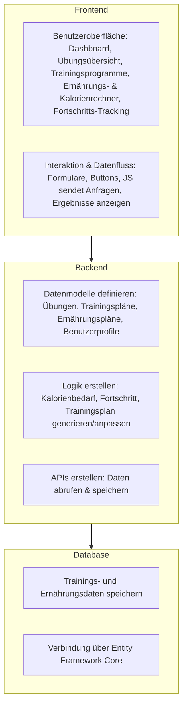
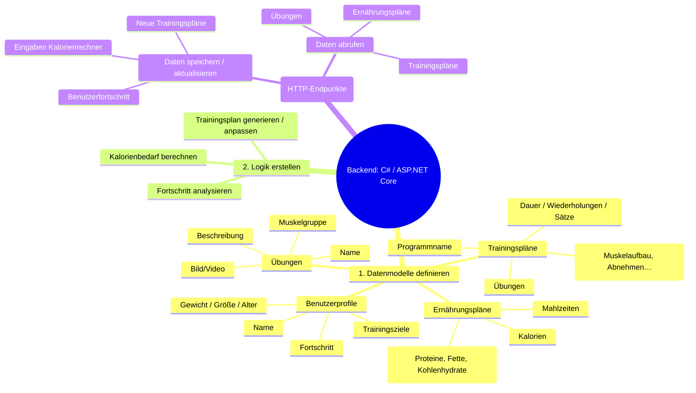
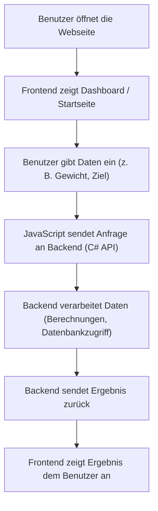

# Teams-Fitness
# Train Digital – Projektidee

Dies ist eine Visualisierung der Kernfeatures von **Train Digital** als digitaler Personal Trainer.
# Übersicht Über unser Programm

```mermaid
flowchart TD
    A[Startseite / Dashboard]

    A --> B[Übungsübersicht]
    B --> B1[Übung auswählen]
    B --> B2[Beschreibung, Bilder/Videos]
    B --> B3[Muskelgruppe anzeigen]

    A --> C[Trainingsprogramme]
    C --> C1[Programm auswählen: Muskelaufbau]
    C --> C2[Programm auswählen: Abnehmen]
    C --> C3[Programm auswählen: Ganzkörper]
    C --> C4[Programm auswählen: Split]
    C --> C5[Übungen hinzufügen/entfernen]
    C --> C6[Plan speichern]

    A --> D[Ernährung & Kalorien]
    D --> D1[Ernährungspläne anzeigen]
    D --> D2[Kalorien- und Makronährstoffangaben]
    D --> D3[Kalorienrechner individuell]

    A --> E[Fortschritts-Tracking]
    E --> E1[Trainingshistorie]
    E --> E2[Diagramme / Tabellen]
    E --> E3[Zielüberprüfung]

    A --> F[Einstellungen / Profil]
    F --> F1[Benutzername, Ziele, Trainingshäufigkeit]
    F --> F2[Personalisierte Empfehlungen]
```

# Überblick für frontend und backend

# Schema : Backend-Aufbau (c#)

# Arbeitsablauf für den Benutzer

